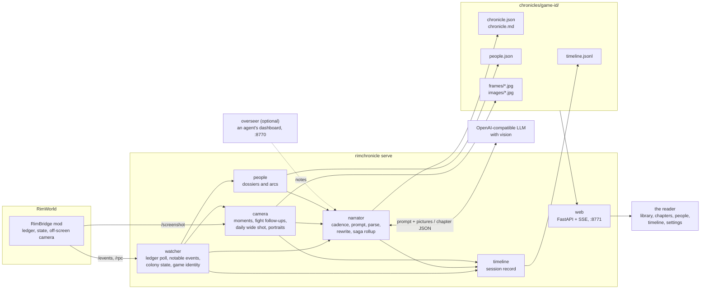
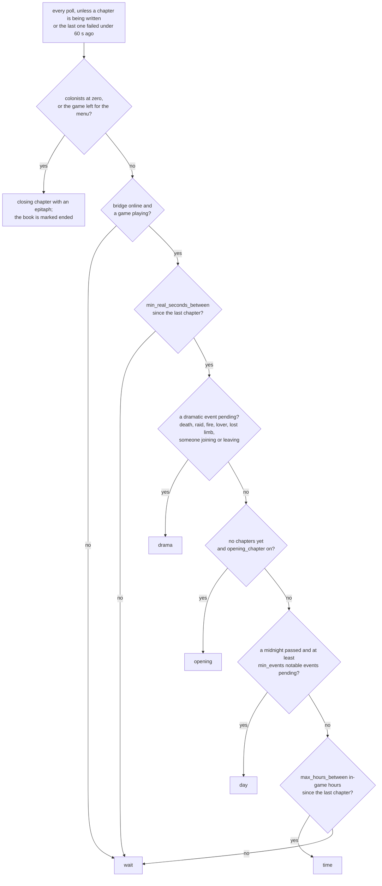

# RimChronicle

RimChronicle watches a running RimWorld colony and writes its story as it happens: an illustrated, chapter-by-chapter chronicle with its own reader. It reads the game through the [RimBridge](https://github.com/zorrobyte/rimagent) mod's loopback HTTP API, keeps a full record of what happens, takes pictures from an off-screen camera the moment something happens, knows who the colonists are (traits, backstories, lovers, grudges, scars), and asks a vision-capable language model to write the next chapter in one of nine voices.

It is written for a human at the keyboard. If an AI agent happens to be driving the same bridge, you can opt in to quoting its notes as "the overseer's log"; nothing depends on that.

## Screenshots

<p align="center"></p>

| The library | The people |
|---|---|
|  |  |

| The timeline | Settings |
|---|---|
|  |  |

There is a light theme too: <a href="docs/reader-light.png">the reader in daylight</a>.

## Quick start

Requirements: Python 3.12 or newer, [uv](https://docs.astral.sh/uv/), RimWorld with the RimBridge mod loaded (it listens on `http://127.0.0.1:8765`), and an OpenAI-compatible chat endpoint with native vision.

```sh
uv sync
cp config.yaml config.local.yaml   # then edit llm.base_url and llm.model (config.local.yaml is gitignored)
uv run rimchronicle serve
```

Open http://127.0.0.1:8771. The library fills in as soon as a game is running; the first chapter appears when something worth telling has happened, or when you press "Write a chapter now". Everything else is on the Settings page.

Other commands:

```sh
uv run rimchronicle once --voice gazette --focus "the raid"   # write one chapter now and print it
uv run rimchronicle rewrite <game-id> <chapter> --voice noir   # re-narrate a chapter from its stored inputs
uv run rimchronicle voices                                     # the narrator voices
uv run rimchronicle list                                       # chronicles on disk
uv run rimchronicle export <game-id>                           # one self-contained HTML book, images inline
uv run pytest                                                  # fast tests with a fake bridge and a fake narrator
```

## How it works

One process, one loop. Every two seconds the watcher polls the bridge's ledger; what it finds goes to the camera, the people file and the session record at once, and to the narrator when a chapter is due. The reader is served from the same process and reads the same files.



### The people

Every colonist gets a dossier from the bridge's `state.pawn`: age, backstory, traits, skills and passions, relations, the room they sleep in, what is bothering them, scars and illnesses, and an "arc" of one-liners accumulated from the ledger (downed by a raccoon on day 14; sad wander after the barracks on day 17). Dossiers are refreshed at chapter time, stalest first, and the arc keeps the last fourteen lines. The dossiers go into every prompt, so the narrator writes a cannibal like a cannibal. The fallen keep their entries with the day and the cause; anyone who leaves the roster without a death (kidnapped, captured, walked off) is listed as gone but not known dead. The People page shows them all with portraits.

### The social layer

RimBridge records the game's own Tales (became lovers, breakup, marriage, social fight, killed a colonist, recruited, tamed, bonded, gave birth, did surgery, ate human meat, and some sixty more), the per-pawn social log (insults, slights, kind words, romance attempts, proposals; idle chat is counted but not listed), relationship changes, diseases and lost limbs, trades, and pet deaths. The chronicle knows that Lumi insulted Kena before Kena stormed off. Chatter is folded into one line of counts ("11 idle chats, 2 long talks") so the narrator has the texture without the noise.

### The camera

RimBridge renders through a second, off-screen camera, so the player's view never moves and a shot costs about 70 ms. The camera shoots the cell where a death, a raid, a break or a fire just happened (no more than one shot of the same kind per `debounce_seconds`, at most `max_per_chapter` between chapters); follows a fight with frames on the hostiles' centre 20 and 60 seconds after they arrive; takes one wide shot of the base per in-game day for the time-lapse; and a portrait of each colonist once a day. A chapter attaches the wide shot plus the best moments since the last chapter, dramatic ones first, captioned, so the model can see the action. If nothing was caught live, it falls back to a shot of the most interesting event's cell taken at writing time.

### The record

Everything lands in `chronicles/<game-id>/timeline.jsonl`: every ledger event (all kinds, not only the notable ones), a state sample every `timeline.state_every_seconds`, every frame the camera took, and every chapter, each stamped with the in-game day and hour and the real time. The Timeline page plays the time-lapse, draws mood, food, wealth, colonists and threat over the days, and marks every event and chapter. The record is also what makes re-narration and the exported book's contact sheet of days possible; nothing in the write path depends on it.

### The voices

Nine voices, each a system prompt with its own register:

| Voice | Register |
|---|---|
| The Chronicler | Dry, specific, occasionally wry; a historian who was there and is not impressed. The fallback when nothing else is set. |
| The Skald | A saga in modern English: epithets earned from deeds, fate and weather as actors, the dead given their due. |
| The Gazette | The settlement's one-sheet newspaper: dateline, a source close to the kitchen, a closing WANTED, FOR SALE, LOST or CORRECTION line. |
| The Naturalist | A field observer's notebook: patient, clinical, faintly amused, with deadpan footnotes. |
| The Diary | First person from one colonist (the best talker, unless you choose); when they die the book passes to a survivor, who says so. |
| The Noir | Hardboiled: rain, short sentences, everyone has an angle, the ledger is the case file. |
| The Storyteller | Cassandra, Randy or Phoebe in character, chosen by the game's own storyteller. `config.yaml` ships with this one selected. |
| The Quarterly | An operations report to a distant, indifferent board: Personnel, Operations, Incidents, Risks, Action items. |
| Custom | Your own system prompt from the settings page. |

Every voice shares the same core rules, appended to its register: nothing invented, the first sentence has a colonist as its subject, name the people and the place, translate the game's labels into English (no thought labels, no percentages, no "pawn"), no map coordinates, a short list of banned words, a word budget, and a closing "State of the colony" tally line that is appended if the model forgets it. The model returns a title, a one-line summary, a pull quote and the body as JSON; the pull quote is only kept if it really appears in the body. Pick a default in Settings, override it per chronicle, rewrite any chapter in another voice (the last six renderings are kept), and add an author's directive ("focus on Lumi's decline") that rides along with every prompt.

### Memory and suspense

Every `saga_every` chapters the older summaries are folded by the model into a rolling "story so far" paragraph of at most 180 words, keeping the last two chapters verbatim, so long colonies keep their arcs without growing the prompt. Each prompt also carries the open threads (alerts, quests, hostiles on the map, unanswered letters, food under three days) with instructions to use them for tension and not resolve them, and what changed since the last chapter (who joined or died, how the mood, wealth and food moved, how many days passed). Events from the abandoned future of a loaded save are filtered out by the in-game clock.

### When a chapter is written

The narrator checks on every poll. Closing chapters skip the queue; everything else waits out the real-seconds floor first, then the triggers are tried in this order.



"Write a chapter now" in the reader and `rimchronicle once` bypass all of this. If the model call fails, the events go back on the pile and the next attempt waits a minute. A game is identified by its world seed, its start tick and the world's own random id, so a new game opens a new book and a reloaded save resumes the old one from its last ledger position; two colonies started from the same seed stay two books, and a roster with nobody in common with the one last seen is treated as a new game even if all three agree. Books are titled by the settlement's name, picked up again at every chapter in case you rename it.

## Configuration

`config.yaml` ships with generic localhost defaults. Put private values in `config.local.yaml` (gitignored); it is deep-merged on top, and the Settings page writes to it. Changes from the Settings page apply immediately; the `web`, `timeline` and `storage` sections are file-only.

| Key | Default | Meaning |
| --- | --- | --- |
| `bridge.url` | `http://127.0.0.1:8765` | RimBridge base URL |
| `bridge.poll_seconds` | `2` | ledger poll interval |
| `bridge.state_refresh_seconds` | `20` | how often the colony state and roster are refreshed |
| `bridge.timeout_s` | `15` | HTTP timeout for bridge calls |
| `llm.base_url`, `llm.model`, `llm.api_key` | localhost, `Qwen/Qwen3-VL-32B`, `not-needed` | the OpenAI-compatible endpoint with vision |
| `llm.max_tokens`, `llm.temperature`, `llm.timeout_s` | `1200`, `0.7`, `240` | per-chapter budget (voices set their own temperature) |
| `llm.disable_thinking` | `true` | sends `chat_template_kwargs.enable_thinking=false` (Qwen-style servers) |
| `narrator.voice` | `storyteller` | default voice as shipped in `config.yaml`; the code falls back to `chronicler`; a chronicle can override it |
| `narrator.custom_prompt`, `narrator.directive` | `""` | the Custom voice's prompt; an author's directive for every chapter |
| `narrator.min_events`, `max_hours_between`, `min_real_seconds_between` | `4`, `24`, `120` | cadence |
| `narrator.opening_chapter` | `true` | write an introduction when a colony is first seen |
| `narrator.moments_per_chapter` | `3` | camera moments attached besides the wide shot |
| `narrator.saga_every` | `8` | fold older chapter summaries into the story so far every N chapters |
| `narrator.dossier_colonists` | `12` | colonists described in full; the rest get one line |
| `narrator.base_width_cells`, `event_width_cells` | `50`, `30` | the wide shot and the fallback event shot |
| `narrator.label_anchors`, `grid` | `false` | draw anchor names or a faint 10-cell grid on fallback shots |
| `camera.moments`, `follow_fight`, `daily`, `portraits` | `true` | what the camera shoots |
| `camera.max_per_chapter`, `debounce_seconds` | `8`, `10` | how often |
| `camera.moment_width_cells`, `portrait_width_cells`, `frame_max_px` | `24`, `8`, `1024` | framing |
| `timeline.state_every_seconds` | `60` | how often a state sample is recorded |
| `overseer.enabled`, `overseer.url`, `overseer.poll_seconds` | `false`, `http://127.0.0.1:8770`, `5` | opt in to quoting an agent's notes if its dashboard is up |
| `web.host`, `web.port` | `127.0.0.1`, `8771` | where the reader is served |
| `storage.dir` | `chronicles` | where chronicles are written (relative to the project) |

Set `RIMCHRONICLE_HOME` to run against a different project directory (config and chronicles are looked up there); that is also how to write test chapters without touching your real book.

## Layout

```
rimchronicle/
  bridge.py     HTTP client for RimBridge
  config.py     config.yaml deep-merged with config.local.yaml; the keys the Settings page may change
  watcher.py    ledger polling, notable events, colony state, game identity, the timeline tap
  camera.py     moments, fight follow-ups, daily wide shots, portraits
  people.py     colonist dossiers and arcs (people.json)
  timeline.py   the session record (timeline.jsonl)
  voices.py     the narrator voices and the shared core rules
  narrator.py   cadence, the prompt, the model call, parsing, rewriting, the saga rollup
  overseer.py   optional agent notes from a dashboard
  llm.py        the OpenAI-compatible chat client
  images.py     JPEG encoding and the optional anchor/grid overlay
  store.py      chronicle.json, chronicle.md, images and frames
  export.py     single-file HTML book with the people and a contact sheet of days
  engine.py     one loop that ties it together, settings that apply live, an event hub
  web.py        FastAPI routes and SSE
  static/       the reader: library, reader, people, timeline, settings (no build step)
  cli.py        serve, once, rewrite, voices, export, list
tests/          fake bridge, fake narrator, fast tests
```

## License

MIT, see `LICENSE`.
