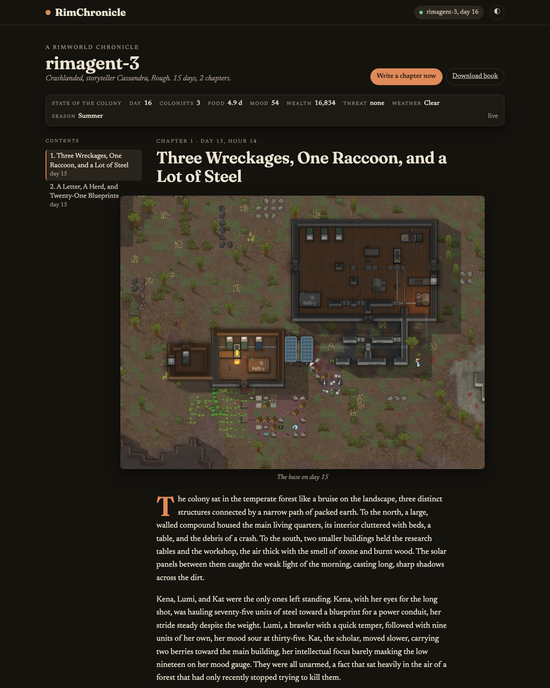
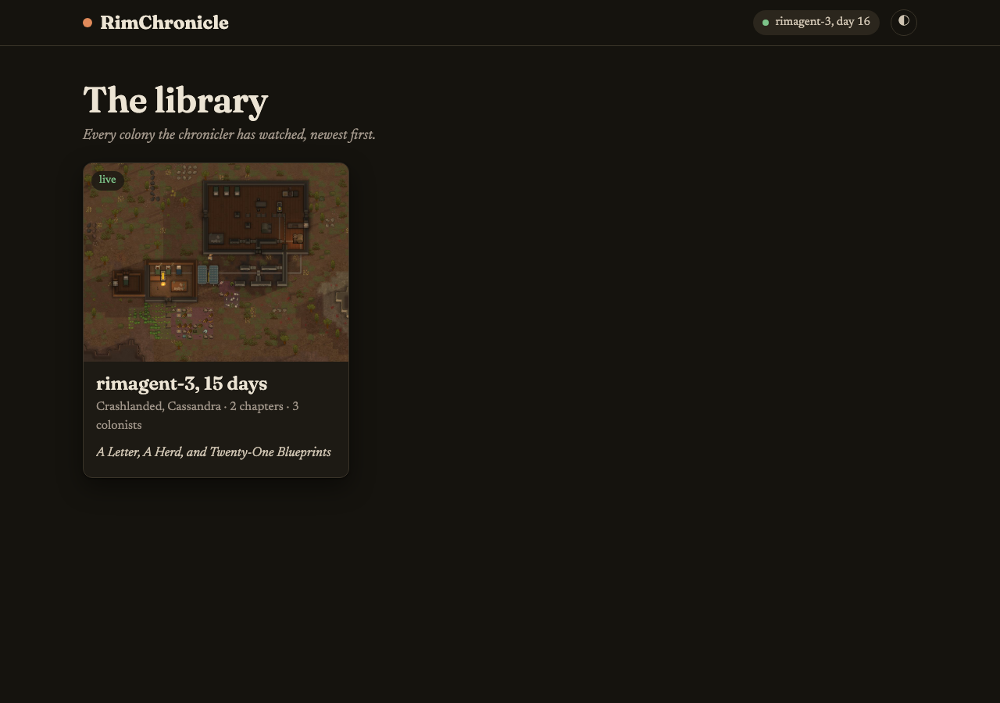
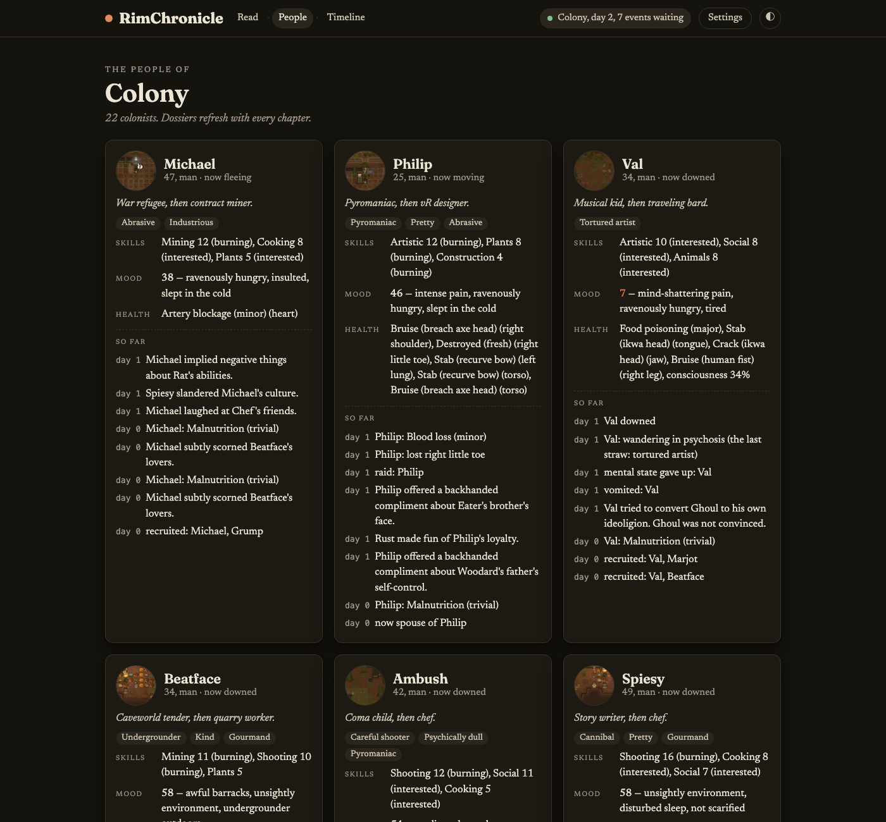
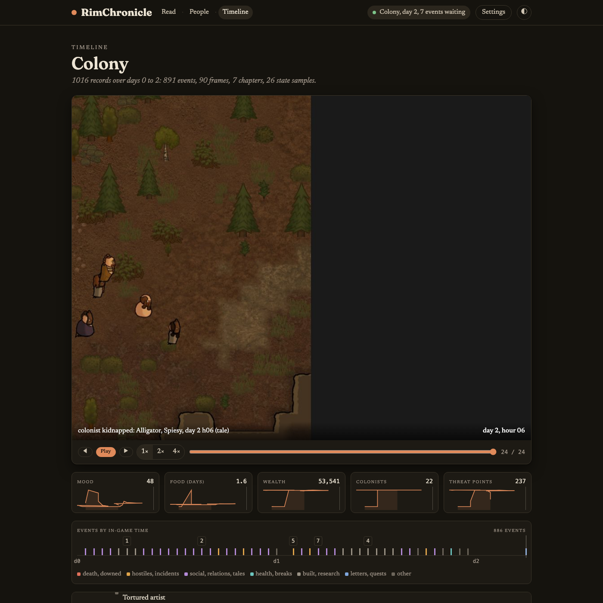
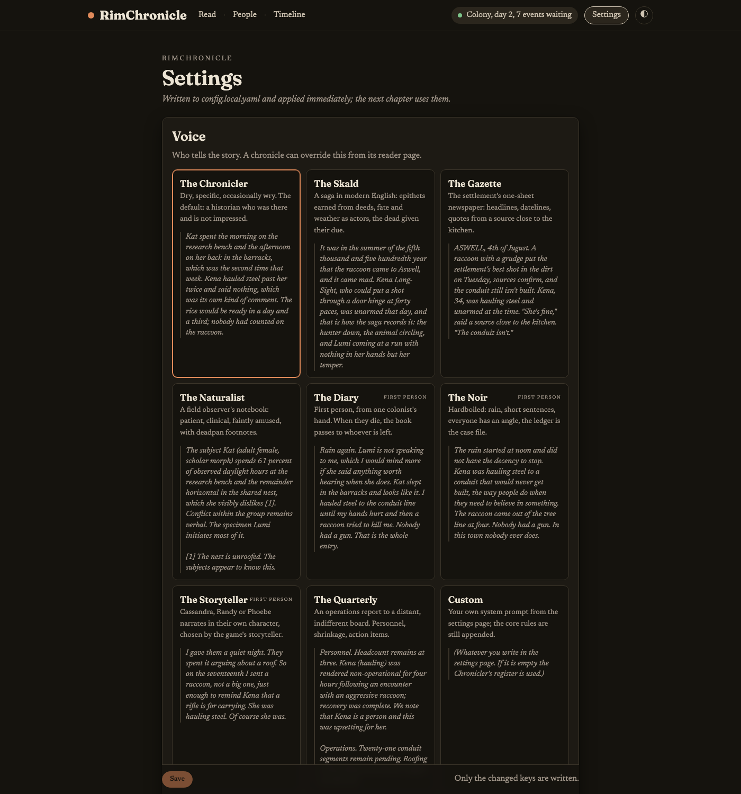

# RimChronicle

RimChronicle watches a running RimWorld colony and writes its story as it happens: an illustrated, chapter-by-chapter chronicle with its own reader. It reads the game through the [RimBridge](https://github.com/zorrobyte/rimagent) mod's loopback HTTP API, keeps a full record of what happens, takes pictures from an off-screen camera the moment something happens, knows who the colonists are (traits, backstories, lovers, grudges, scars), and asks a vision-capable language model to write the next chapter in one of nine voices.

It is written for a human at the keyboard. If an AI agent happens to be driving the same bridge, its notes can be quoted as "the overseer's log"; nothing depends on that.

## Screenshots

<p align="center"></p>

| The library | The people |
|---|---|
|  |  |

| The timeline | Settings |
|---|---|
|  |  |

There is a light theme too: <a href="docs/reader-light.png">the reader in daylight</a>.

## Quick start

Requirements: Python 3.12 or newer, [uv](https://docs.astral.sh/uv/), RimWorld with the RimBridge mod loaded (it listens on `http://127.0.0.1:8765`), and an OpenAI-compatible chat endpoint with native vision.

```sh
uv sync
cp config.yaml config.local.yaml   # then edit llm.base_url and llm.model (config.local.yaml is gitignored)
uv run rimchronicle serve
```

Open http://127.0.0.1:8771. The library fills in as soon as a game is running; the first chapter appears when something worth telling has happened, or when you press "Write a chapter now". Everything else is on the Settings page.

Other commands:

```sh
uv run rimchronicle once --voice gazette --focus "the raid"   # write one chapter now and print it
uv run rimchronicle rewrite <game-id> <chapter> --voice noir   # re-narrate a chapter from its stored inputs
uv run rimchronicle voices                                     # the narrator voices
uv run rimchronicle list                                       # chronicles on disk
uv run rimchronicle export <game-id>                           # one self-contained HTML book, images inline
uv run pytest                                                  # fast tests with a fake bridge and a fake narrator
```

## What it does

**The people.** Every colonist gets a dossier from the bridge's `state.pawn`: age, backstory, traits, skills and passions, relations, the room they sleep in, what is bothering them, scars and illnesses, and an "arc" of one-liners accumulated from the ledger (downed by a raccoon on day 14; sad wander after the barracks on day 17). The dossiers go into every prompt, so the narrator writes a cannibal like a cannibal, and the fallen keep their entries with the day and the cause. The People page shows them with portraits.

**The social layer.** RimBridge records the game's own Tales (became lovers, breakup, marriage, social fight, killed a colonist, recruited, tamed, bonded, gave birth, did surgery, ate human meat, and some sixty more), the per-pawn social log (insults, slights, kind words, romance attempts, proposals; idle chat is counted but not listed), relationship changes, diseases and lost limbs, trades, and pet deaths. The chronicle knows that Lumi insulted Kena before Kena stormed off.

**The camera.** RimBridge renders through a second, off-screen camera, so the player's view never moves and a shot costs about 70 ms. The camera shoots the cell where a death, a raid, a break or a fire just happened; follows a fight with frames on the hostiles' centre 20 and 60 seconds later; takes one wide shot per in-game day for the time-lapse; and a portrait of each colonist once a day. A chapter attaches the wide shot plus the best moments since the last chapter, captioned, so the model can see the action.

**The record.** Everything lands in `chronicles/<game-id>/timeline.jsonl`: every ledger event (all kinds, not only the notable ones), state samples, frames, chapters and any overseer notes. The Timeline page plays the time-lapse, draws mood, food, wealth, colonists and threat over the days, and marks every event and chapter. The record is also what makes re-narration possible.

**The voices.** The Chronicler (dry, specific, wry; the default), the Skald (epithets, fate, the dead given their due), the Gazette (dateline, a source close to the kitchen, a WANTED line), the Naturalist (field notes with deadpan footnotes), the Diary (first person from one colonist; when they die the book passes to a survivor), the Noir, the Storyteller (Cassandra, Randy or Phoebe in character), the Quarterly (a memo to an indifferent board), and Custom (your own prompt). Every voice shares the same core rules: nothing invented, name the people and the place, translate the game's labels into English, end on the colony's tally line. Pick a default in Settings, override it per chronicle, rewrite any chapter in another voice (earlier renderings are kept), and add an author's directive ("focus on Lumi's decline") that rides along with every prompt.

**Memory and suspense.** After every eight chapters the older summaries are folded into a rolling "story so far" paragraph, so long colonies keep their arcs without growing the prompt. Each prompt also carries the open threads (alerts, quests, hostiles on the map, unanswered letters, low stocks) and what changed since the last chapter (who joined or died, how the mood and the wealth moved).

## How it works

```
RimWorld + RimBridge  --/events, /rpc, /screenshot-->  watcher --> camera --> narrator --> chronicles/<game-id>/
                                                          |          |           ^  ^          chronicle.json  chronicle.md
   agent dashboard (optional) --/api/events--> overseer --+          |    people |  |          people.json  timeline.jsonl
                                                                     v           |  |          images/*.jpg  frames/*.jpg
                                                                  timeline ------+  v
                                                                                 OpenAI-compatible LLM
                                              web UI (FastAPI + SSE, port 8771) reads the same files
```

A chapter is due on a dramatic event (a death, a raid, a fire, a lover, a lost limb, someone joining or leaving), on a finished in-game day with at least `min_events` notable events, after `max_hours_between` in-game hours, as an opening when a colony is first seen, and as a closing chapter with an epitaph when every colonist is gone or the game is left; never more often than `min_real_seconds_between` real seconds. A game is identified by its world seed, its start tick and the world's own random id, so a new game opens a new book and a reloaded save resumes the old one; two colonies started from the same seed stay two books, and a roster with nobody in common with the one last seen is treated as a new game even if all three agree. Books are titled by the settlement's name.

## Configuration

`config.yaml` ships with generic localhost defaults. Put private values in `config.local.yaml` (gitignored); it is deep-merged on top, and the Settings page writes to it. Changes from the Settings page apply immediately.

| Key | Default | Meaning |
| --- | --- | --- |
| `bridge.url` | `http://127.0.0.1:8765` | RimBridge base URL |
| `bridge.poll_seconds` | `2` | ledger poll interval |
| `bridge.state_refresh_seconds` | `20` | how often the colony state and roster are refreshed |
| `llm.base_url`, `llm.model`, `llm.api_key` | localhost, `Qwen/Qwen3-VL-32B`, `not-needed` | the OpenAI-compatible endpoint with vision |
| `llm.max_tokens`, `llm.temperature`, `llm.timeout_s` | `1200`, `0.7`, `240` | per-chapter budget (voices set their own temperature) |
| `llm.disable_thinking` | `true` | sends `chat_template_kwargs.enable_thinking=false` (Qwen-style servers) |
| `narrator.voice` | `chronicler` | default voice; a chronicle can override it |
| `narrator.custom_prompt`, `narrator.directive` | `""` | the Custom voice's prompt; an author's directive for every chapter |
| `narrator.min_events`, `max_hours_between`, `min_real_seconds_between` | `4`, `24`, `120` | cadence |
| `narrator.opening_chapter` | `true` | write an introduction when a colony is first seen |
| `narrator.moments_per_chapter` | `3` | camera moments attached besides the wide shot |
| `narrator.saga_every` | `8` | fold older chapter summaries into the story so far every N chapters |
| `narrator.dossier_colonists` | `12` | colonists described in full; the rest get one line |
| `narrator.base_width_cells`, `event_width_cells` | `50`, `30` | the wide shot and the fallback event shot |
| `camera.moments`, `follow_fight`, `daily`, `portraits` | `true` | what the camera shoots |
| `camera.max_per_chapter`, `debounce_seconds` | `8`, `10` | how often |
| `camera.moment_width_cells`, `portrait_width_cells`, `frame_max_px` | `24`, `8`, `1024` | framing |
| `timeline.state_every_seconds` | `60` | how often a state sample is recorded |
| `overseer.enabled`, `overseer.url` | `true`, `http://127.0.0.1:8770` | quote an agent's notes if its dashboard is up |
| `web.host`, `web.port` | `127.0.0.1`, `8771` | where the reader is served |
| `storage.dir` | `chronicles` | where chronicles are written (relative to the project) |

Set `RIMCHRONICLE_HOME` to run against a different project directory (config and chronicles are looked up there); that is also how to write test chapters without touching your real book.

## Layout

```
rimchronicle/
  bridge.py     HTTP client for RimBridge
  watcher.py    ledger polling, notable events, colony state, game identity, the timeline tap
  camera.py     moments, fight follow-ups, daily wide shots, portraits
  people.py     colonist dossiers and arcs (people.json)
  timeline.py   the session record (timeline.jsonl)
  voices.py     the narrator voices and the shared core rules
  narrator.py   cadence, the prompt, the model call, parsing, rewriting, the saga rollup
  overseer.py   optional agent notes from a dashboard
  store.py      chronicle.json, chronicle.md, images and frames
  export.py     single-file HTML book with the people and a contact sheet of days
  engine.py     one loop that ties it together, settings that apply live, an event hub
  web.py        FastAPI routes and SSE
  static/       the reader: library, reader, people, timeline, settings (no build step)
  cli.py        serve, once, rewrite, voices, export, list
tests/          fake bridge, fake narrator, fast tests
```

## License

MIT, see `LICENSE`.
