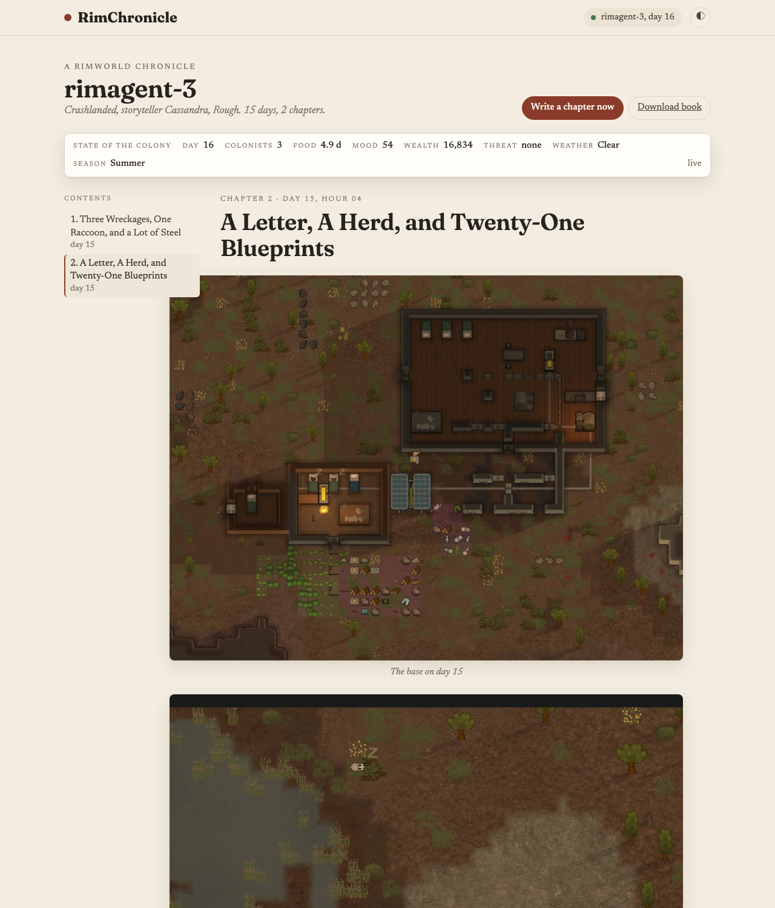

# RimChronicle

RimChronicle watches a running RimWorld colony and writes its story as it happens: an illustrated, chapter-by-chapter chronicle with its own web page. It reads the game through the [RimBridge](https://github.com/) mod's loopback HTTP API, keeps a ledger of what matters (deaths, raids, arrivals, breakdowns, breakthroughs, quiet days), takes pictures of the base from an off-screen camera, and asks a vision-capable language model to write the next chapter in a dry, specific chronicle voice.

It does not care who is playing. A human at the keyboard and an AI agent driving the same bridge produce the same kind of book. If an agent's dashboard happens to be reachable, the narrator can quote its step notes as "the overseer's log"; if not, the chronicle is written from the ledger alone.

## Screenshots

<p align="center"></p>

| Library | Reader, light theme |
|---|---|
|  |  |

## Quick start

Requirements: Python 3.12 or newer, [uv](https://docs.astral.sh/uv/), RimWorld with the RimBridge mod loaded (it listens on `http://127.0.0.1:8765`), and an OpenAI-compatible chat endpoint with native vision.

```sh
uv sync
cp config.yaml config.local.yaml   # then edit llm.base_url and llm.model (config.local.yaml is gitignored)
uv run rimchronicle serve
```

Open http://127.0.0.1:8771. The library fills in as soon as a game is running; the first chapter appears when something worth telling has happened, or when you press "Write a chapter now".

Other commands:

```sh
uv run rimchronicle once               # write one chapter right now and print it
uv run rimchronicle list               # chronicles on disk
uv run rimchronicle export <game-id>   # one self-contained HTML book, images inline
uv run pytest                          # fast tests with a fake bridge and a fake narrator
```

## How it works

```
RimWorld + RimBridge  --/events, /rpc, /screenshot-->  watcher  -->  narrator  -->  chronicles/<game-id>/
                                                         |             |                 chronicle.json
   agent dashboard (optional) --/api/events-->  overseer -+             |                 chronicle.md
                                                                       v                 images/*.jpg
                                                           OpenAI-compatible LLM
                                                                       ^
                                              web UI (FastAPI + SSE, port 8771) reads the same files
```

**Watcher** (`rimchronicle/watcher.py`) polls `/events` every two seconds. It keeps only notable kinds (`colonist_died`, `colonist_downed`, `colonist_joined`, `colonist_left`, `incident`, `hostile_group`, `hostile_group_gone`, `manhunter`, `danger`, `mental_break`, `letter`, `quest`, `research_finished`, `built` minus walls, conduits and floors, `building_lost`, `construction_failed`, `dialog_answered`, `day`, `trade`), refreshes a compact colony state from `state.summary` and the roster from `state.pawns`, and survives the bridge going away. A game is identified by its world seed plus its start tick, so a new game (even with the same seed) opens a new chronicle and a reloaded save resumes the old one.

**Narrator** (`rimchronicle/narrator.py`) decides when a chapter is due:

- a dramatic event: a death, a raid or hostile group arriving, a fire, a colonist joining or leaving;
- a finished in-game day with at least `min_events` notable events;
- `max_hours_between` in-game hours since the last chapter;
- an opening chapter the first time a colony is seen;
- a closing chapter when every colonist is gone or the game is left, with an epitaph;
- never more often than `min_real_seconds_between` real seconds.

It builds one prompt: a system prompt in the chronicle voice, one-line summaries of every prior chapter, the roster, the new ledger lines, the numbers, and one or two pictures (the base from above, and the place where the triggering event happened when it has a cell). The model is asked for `{"title", "summary", "body"}`; the parser tolerates code fences, chatter around the JSON, raw newlines inside strings, and plain prose. Endpoint errors are logged and the events are kept for the next attempt.

**Storage** (`rimchronicle/store.py`): `chronicles/<game-id>/chronicle.json` is the source of truth (seed, scenario, storyteller, status, chapters with day, hour, images and the ledger sequence numbers each chapter used, epitaph); `chronicle.md` is regenerated alongside it; images are JPEG quality 85. Restarting `serve` resumes where it left off.

**Web UI** (`rimchronicle/web.py`, `rimchronicle/webpage.py`): one page, no build step. A library of colonies and a reader with chapter images, serif prose at a 65 character measure, a sticky state strip, contents, previous and next, live updates over server-sent events, a "Write a chapter now" button for the live game, and "Download book", which is the same export as the CLI.

## Configuration

`config.yaml` ships with generic localhost defaults. Put private values in `config.local.yaml` (gitignored); it is deep-merged on top.

| Key | Default | Meaning |
| --- | --- | --- |
| `bridge.url` | `http://127.0.0.1:8765` | RimBridge base URL |
| `bridge.poll_seconds` | `2` | ledger poll interval |
| `bridge.state_refresh_seconds` | `20` | how often `state.summary` and the roster are refreshed |
| `bridge.timeout_s` | `15` | HTTP timeout for bridge calls |
| `llm.base_url` | `http://127.0.0.1:8000/v1` | OpenAI-compatible chat endpoint with vision |
| `llm.model` | `Qwen/Qwen3-VL-32B` | model name sent to the endpoint |
| `llm.api_key` | `not-needed` | bearer token, if the endpoint wants one |
| `llm.timeout_s` | `240` | request timeout |
| `llm.max_tokens` | `1200` | completion budget per chapter |
| `llm.temperature` | `0.7` | sampling temperature |
| `llm.disable_thinking` | `true` | sends `chat_template_kwargs.enable_thinking=false` (Qwen-style servers ignore it harmlessly otherwise) |
| `narrator.min_events` | `4` | events a finished day needs to earn a chapter |
| `narrator.max_hours_between` | `24` | in-game hours before a chapter is written regardless |
| `narrator.min_real_seconds_between` | `120` | real-time floor between chapters |
| `narrator.opening_chapter` | `true` | write an introduction when a colony is first seen |
| `narrator.base_width_cells` | `50` | width of the wide shot of the base |
| `narrator.event_width_cells` | `30` | width of the close shot of the event |
| `narrator.label_anchors` | `false` | draw anchor names (from `anchor.list`) on the pictures |
| `narrator.grid` | `false` | draw a faint 10-cell grid on the pictures |
| `overseer.enabled` | `true` | quote an agent's notes if its dashboard is up |
| `overseer.url` | `http://127.0.0.1:8770` | the agent dashboard |
| `overseer.poll_seconds` | `5` | how often it is polled |
| `web.host`, `web.port` | `127.0.0.1`, `8771` | where the reader is served |
| `storage.dir` | `chronicles` | where chronicles are written (relative to the project) |

Set `RIMCHRONICLE_HOME` to run against a different project directory (config and chronicles are looked up there).

## Layout

```
rimchronicle/
  bridge.py     HTTP client for RimBridge
  watcher.py    ledger polling, notable events, colony state, game identity
  narrator.py   cadence rules, prompt, model call, parsing
  overseer.py   optional agent notes from a dashboard
  store.py      chronicle.json, chronicle.md, images
  export.py     single-file HTML book
  engine.py     one loop that ties it together plus an event hub
  web.py        FastAPI routes and SSE
  webpage.py    the single-page reader (inline CSS and JS)
  cli.py        serve, once, export, list
tests/          fake bridge, fake narrator, fast tests
```

## License

MIT, see `LICENSE`.
